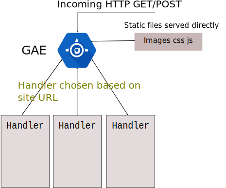

* * *

 
 
 

* * *

 
 
 

* Handlers are served by objects of various [WSGI][wgsi] (Web Server Gateway Interface)
python Web frameworks like:
  * [webapp2][webapp2] provided by Google App Engine
  * [Django][django]
  * [Flask][flask]
  * [web2py][web2py]
  * [Pyramid][pyramid]

[wgsi]: https://en.wikipedia.org/wiki/Web_Server_Gateway_Interface "WGSI"
[webapp2]: http://webapp2.readthedocs.io/en/latest/index.html "webapp2"
[django]: https://en.wikipedia.org/wiki/Django_(web_framework) "Django"
[flask]: https://en.wikipedia.org/wiki/Flask_(web_framework) "Flask"
[web2py]: https://en.wikipedia.org/wiki/Web2py "web2py"
[pyramid]: https://en.wikipedia.org/wiki/Pylons_project#Pyramid "pyramid"
